<h1>Virgo ♍︎ Rust Crate Management for Vim 🦀</h1>

<p align="center">
</img>
</p>

<p align="center">Virgo (Vi<s>m</s> & <s>Ca</s>rgo) is a Rust crate management system, seamlessly integrated into Vim.<br></p>


---

## 📖 Table of Contents
- [🔥 Features](#features)
- [🚀 What's New](#whats-new)
- [🚀 Installation](#installation)
- [🛠️ Commands Overview](#commands-overview)
- [📸 Usage Examples](#usage-examples)
- [🛠️ Troubleshooting](#troubleshooting)

---
## <a id="features"></a> 🔥 Features
✅ **Crate Management** – Search, add, remove, update, and rollback Rust crates effortlessly.<br>
✅ **Feature Orchestration** – Add and remove crate features on the fly.<br>
✅ **Native Vim Compatibility** – Seamlessly integrates with Vim using intuitive `:virgo` commands.<br>
✅ **Blazing Fast Performance** – Built in Rust for maximum speed and efficiency.<br>
✅ **Fully Automated** – No manual edits needed; Virgo takes care of `Cargo.toml` for you.<br>
✅ **Crate Info** – Discover documentation, stats, and detailed crate info directly in Vim.<br>
✅ **Backup & Restore** – Secure your `Cargo.toml`, rollback safely, and prevent accidental changes.<br>
✅ **Visual Feedback** – Enhanced output formatting for structured readability and usability.<br> 
✅ **Dependency Insights** – Examine dependencies, visualize trees, track updates, and filter changelogs.<br>
✅ **Breaking Changes** – Analyze `Cargo.toml` for breaking updates before they happen.<br>
✅ **Rollback Protection** – Easily revert changes, maintain stability, and prevent unintended updates.<br>
✅ **Compare Versions** – Instantly compare bleeding-edge vs latest stable versions.<br>
✅ **Docs Lookup** – Fetch crate documentation and examples directly from **docs.rs**.<br>
✅ **Complete Cargo.toml Management** – Health checks, edits, structured initialization, and validation.<br>

---

## <a id="whats-new"></a>🚀 What's New - v1.4.0

 **Optimizations** – Added threading to outdated and depends commands which access crates.io concurrently, siginificantly reducing delays<br>

 
---

## <a id="installation"></a> 🚀 Installation

### **With vim-plug**

Add this to your Vim configuration (`~/.vimrc` or `~/.config/nvim/init.vim`):
```vim
Plug 'dntstck/virgo'
```
Then run:
```vim
:PlugInstall
```

### **With Vundle**

Add this to your `.vimrc`:
```vim
Plugin 'dntstck/virgo'
```
Then install it with:
```vim
:PluginInstall
```

### **With Pathogen**

Clone the repo into your Vim bundle directory:
```bash
git clone https://github.com/dntstck/virgo-vim ~/.vim/bundle/virgo-vim
```
---

## <a id="commands-overview"></a> 🛠️ Commands Overview

### 🔍 Search & Information

```vim
:virgo search      " Search for a crate on crates.io
:virgo stats       " Display the stats of a crate
:virgo info        " Displays detailed info of a crate
:virgo versions    " Displays all available versions of a crate
:virgo trending    " Displays trending crates
```

### 🛠 Dependency Management

```vim
:virgo add         " Adds selected crate, use -f <feature> to add crate features 
:virgo remove      " Removes selected crate, use -f <feature> to remove crate features
:virgo update      " Updates selected dependency
:virgo rollback    " Rolls back to a previous version
:virgo compare     " Compares bleeding-edge with latest stable version of a selected crate
:virgo depends     " Displays all the dependencies of a selected crate
```

### 📜 Project & Cargo.toml Handling 

```vim
:virgo all         " Displays all installed dependencies in Cargo.toml
:virgo health      " Checks current Cargo.toml for overall health
:virgo breaking    " Analyzes Cargo.toml for breaking changes
:virgo lockfile    " Inspects Cargo.lock for precise version tracking
:virgo changelog   " View changelog for a selected crate (Filter by major, minor, patch, since x.x.x & more)
:virgo tree        " Display a tree of dependencies for a crate
:virgo init        " Creates a basic Cargo.toml in the current dir
:virgo edit        " Edit Name, Version, and Edition in the current Cargo.toml 
```

### 🔄 Backup & Restore

``` vim
:virgo backup      " Backup Cargo.toml
:virgo restore     " Restore Cargo.toml from latest backup
```

### 📚 Documentation & Help

```vim
:virgo docs        "View documentation for a selected crate, use -o to open in docs.rs or -e to view examples
:virgo help        "Print this message or the help of the given subcommand(s)
:virgo about       "Display information about Virgo
```

---

## <a id="usage-examples"></a>📸 Usage Examples

### 🛠 Adding a Crate
Instantly add crates without leaving Vim.<br>
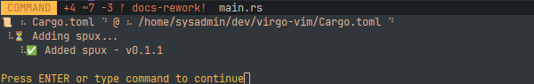 <br>

### 🔍 Viewing Installed Crates
Displays all currently installed dependencies in Cargo.toml.  <br>
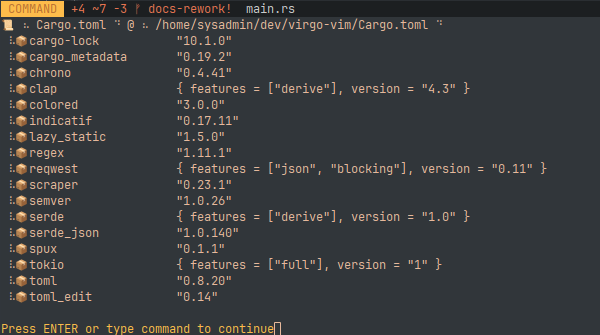  <br>

### 🔄 Creating a Backup
Secure your Cargo.toml before making changes. <br>
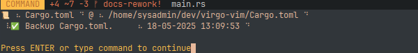 <br>

### ⚠️ Detecting Breaking Changes
Analyze Cargo.toml for potential breaking updates. <br>
 <br>

### 📜 Viewing Changelog Entries
Filter changelogs by major, minor, patch, or version. <br>
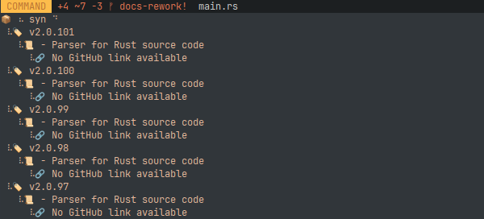 <br>

### 🔍 Comparing Versions
Instantly compare bleeding-edge with latest stable. <br>
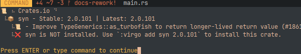 <br>

### 🔗 Inspecting Dependencies
Display dependencies of a selected crate. <br>
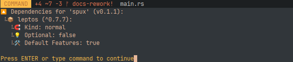 <br>

### 📚 Viewing Documentation & Examples
Quickly fetch crate documentation and code examples. <br>
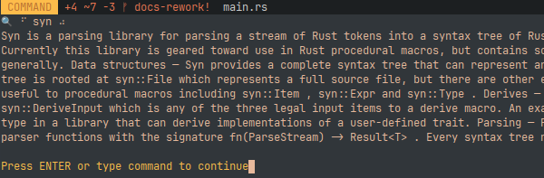 <br>

### 🔎 Viewing Examples
Displays example snippets for a selected crate. <br>
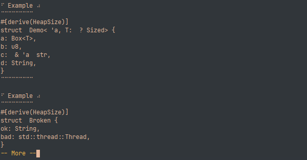 <br>

### 🌐 Opening Docs.rs
Open crate documentation directly in a browser. <br>
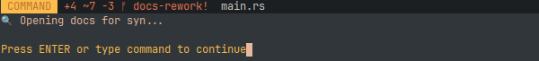 <br>

### ✏️ Editing Cargo.toml
Modify Name, Version, and Edition in Cargo.toml. <br>
 <br>

### ✅ Checking Cargo.toml Health
Verify the integrity and structure of Cargo.toml. <br>
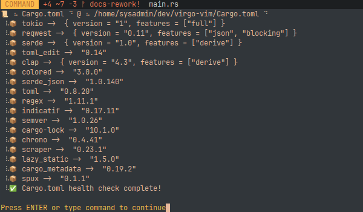 <br>

### ℹ️ Viewing Crate Info
Display detailed information about a crate. <br>
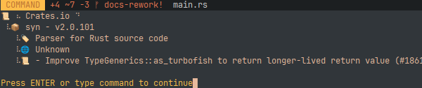 <br>

### 🔑 Inspecting Cargo.lock
Track precise crate versions in Cargo.lock. <br>
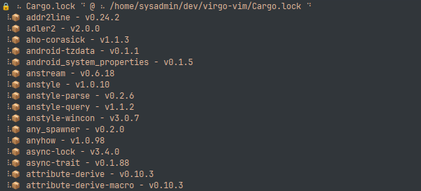 <br>

### ⚠️ Checking Outdated Dependencies
Identify outdated dependencies without Cargo. <br>
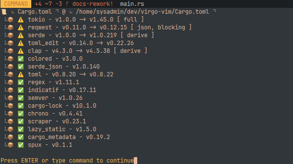 <br>

### ❌ Removing Crates
Easily remove a selected crate. <br>
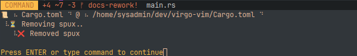 <br>

### 🔄 Restoring a Backup
Revert Cargo.toml to a previous backup. <br>
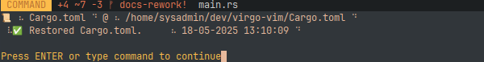 <br>

### ⏪ Rolling Back Versions
Roll back crates to a previous version. <br>
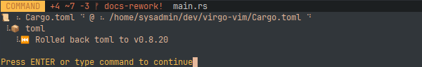 <br>

### 🔎 Searching for Crates
Find dependencies with blazing-fast lookup. <br>
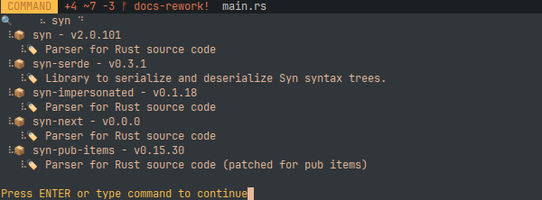 <br>

### 📊 Viewing Crate Stats
Display download counts, ratings, and more. <br>
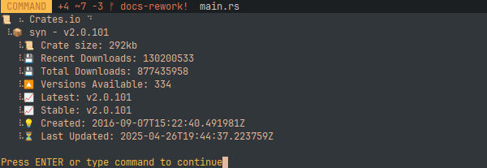 <br>

### 🌳 Viewing Dependency Tree
Display a structured dependency tree for a crate. <br>
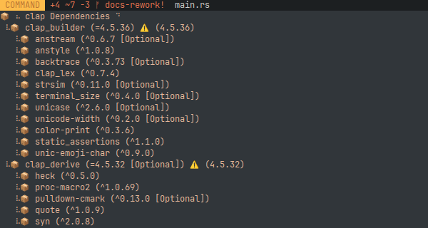 <br>

### 🔥 Discovering Trending Crates
Find trending crates on crates.io. <br>
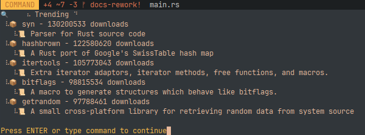 <br>

### 🔄 Updating Crates
Update a dependency to the latest stable version. <br>
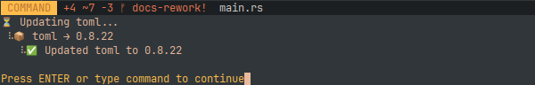 <br>

### 📦 Viewing Available Versions
Display all available versions of a crate. <br>
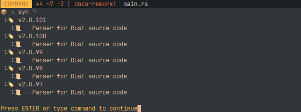 <br>


---


## <a id="troubleshooting"></a> 🛠️ Troubleshooting

### **Common Issues**

**Permission Denied?**
 
```bash
chmod +x ~/.vim/bundle/virgo/bin/virgo
```

**Cargo.lock Conflicts?**

```bash
cargo generate-lockfile
```

