<h1>Virgo ♍︎ Rust Crate Management for Vim 🦀</h1>

<p align="center">
</img>
</p>

Virgo (Vim & Cargo) is a Rust crate management system, seamlessly integrated into Vim.<br>
Search for crates, manage crate features, update Cargo.toml, track dependencies, manage your lockfile,<br>
explore trending crates, access documentation, extract examples from docs.rs and so much more; all without ever leaving Vim!

---

## Table of Contents
- [Features](#features)
- [What's New](#whats-new)
- [Installation](#installation)
- [Commands Overview](#commands-overview)
- [Usage Examples](#usage-examples)
- [Troubleshooting](#troubleshooting)

---
## <a id="features"></a> Features
 **Crate Management** - Search, add, remove, update, and rollback Rust crates effortlessly.<br>
 **Feature Orchestration** - Add and remove crate features on the fly.<br>
 **Native Vim Compatibility** - Seamlessly integrates with Vim using intuitive `:virgo` commands.<br>
 **Blazing Fast Performance** - Built in Rust for maximum speed and efficiency.<br>
 **Fully Automated** - No manual edits needed; Virgo takes care of `Cargo.toml` for you.<br>
 **Crate Info** - Discover documentation, stats, and detailed crate info directly in Vim.<br>
 **Seamless Integration** - Execute streamlined commands instantly using `:virgo`.<br>
 **Backup & Restore** - Secure your `Cargo.toml`, rollback safely, and prevent accidental changes.<br>
 **Visual Feedback** - Enhanced output formatting for structured readability and usability.<br> 
 **Dependency Insights** - Examine dependencies, visualize trees, track updates, and filter changelogs.<br>
 **Breaking Changes** - Analyze `Cargo.toml` for breaking updates before they happen.<br>
 **Rollback Protection** - Easily revert changes, maintain stability, and prevent unintended updates.<br>
 **Compare Versions** - Instantly compare bleeding-edge vs latest stable versions.<br>
 **Docs Lookup** - Fetch crate documentation and examples directly from **docs.rs**.<br>
 **Standalone Outdated Check** - Identify outdated dependencies **without relying on Cargo**.<br>
 **Complete Cargo.toml Management** - Health checks, edits, structured initialization, and validation.<br>

---

## <a id="whats-new"></a>What's New - v1.5.0    

 **OpenSSL** - Removed OpenSSL<br>
 **Performance Tweaks** - Small tweaks for performance<br>
 **Multi Arch Support** - riscv64, armv7, aarch64 & x86_64 are now fully supported.<br>

## <a id="previous-version"></a>Previous Version - v1.4.0    

 **UI Improvements** - Displaying crates, versions and features further refined. <br>
 **Added flags `:virgo add <crate> -f <feature>`** - Add a crates feature with -f<br> 
 **Added flags `:virgo remove <crate> -f <feature>`** - Remove a crates feature with -f<br>
 
---

## <a id="installation"></a>  Installation

### **With vim-plug**

Add this to your Vim configuration (`~/.vimrc` or `~/.config/nvim/init.vim`):
```vim
Plug 'dntstck/virgo'
```
Then run:
```vim
:PlugInstall
```
To ensure you use the correct architecture, please run the install script:
```bash
~/.vim/bundle/virgo/install.sh
```
The install script **must** be run **after** you run `:PluginInstall`

### **With Vundle**

Add this to your `.vimrc`:
```vim
Plugin 'dntstck/virgo'
```
Then install it with:
```vim
:PluginInstall
```

To ensure you use the correct architecture, please run the install script:
```bash
~/.vim/bundle/virgo/install.sh
```

The install script **must** be run **after** you run `:PluginInstall`

### **With Pathogen**

Clone the repo into your Vim bundle directory:
```bash
git clone https://github.com/dntstck/virgo ~/.vim/bundle/virgo
```

To ensure you use the correct architecture, please run the install script:
```bash
~/.vim/bundle/virgo/install.sh
```

The install script **must** be run **after** you run `:PluginInstall`

---

## <a id="commands-overview"></a> Commands Overview

###  Search & Information

```vim
:virgo search " Search for a crate on crates.io
:virgo stats " Display the stats of a crate
:virgo info " Displays detailed info of a crate
:virgo versions " Displays all available versions of a crate
:virgo trending " Displays trending crates
```

###  Dependency Management

```vim
:virgo add " Adds selected crate
:virgo remove " Removes selected crate
:virgo update " Updates selected dependency
:virgo rollback " Rolls back to a previous version
:virgo compare " Compares bleeding-edge with latest stable version of a selected crate
:virgo depends " Displays all the dependencies of a selected crate
```

###  Project & Cargo.toml Handling 

```vim
:virgo all " Displays all installed dependencies in Cargo.toml
:virgo health " Checks current Cargo.toml for overall health
:virgo breaking " Analyzes Cargo.toml for breaking changes
:virgo lockfile " Inspects Cargo.lock for precise version tracking
:virgo changelog " View changelog for a selected crate (Filter by major, minor, patch, since x.x.x & more)
:virgo tree " Display a tree of dependencies for a crate
:virgo init " Creates a basic Cargo.toml in the current dir
:virgo edit " Edit Name, Version, and Edition in the current Cargo.toml 
```

###  Backup & Restore

``` vim
:virgo backup " Backup Cargo.toml
:virgo restore " Restore Cargo.toml from latest backup
```

###  Documentation & Help

```vim
:virgo docs " View documentation for a selected crate, use -o to open in docs.rs or -e to view examples
:virgo help " Print this message or the help of the given subcommand(s)
:virgo about " Display information about Virgo
```

---

## <a id="usage-examples"></a> Usage Examples

### Adding a Crate
Instantly add crates without leaving Vim.<br>
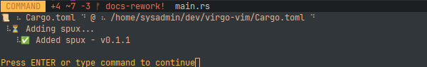 <br>

### Viewing Installed Crates
Displays all currently installed dependencies in Cargo.toml.  <br>
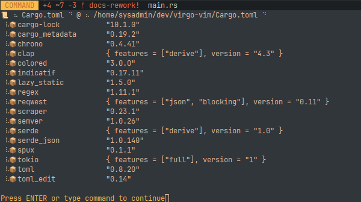  <br>

### Creating a Backup
Secure your Cargo.toml before making changes. <br>
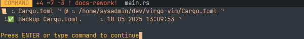 <br>

### Detecting Breaking Changes
Analyze Cargo.toml for potential breaking updates. <br>
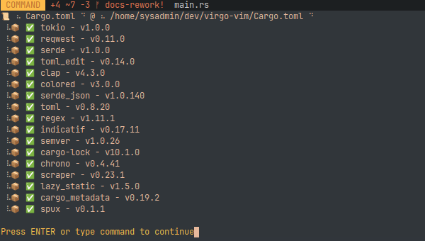 <br>

### Viewing Changelog Entries
Filter changelogs by major, minor, patch, or version. <br>
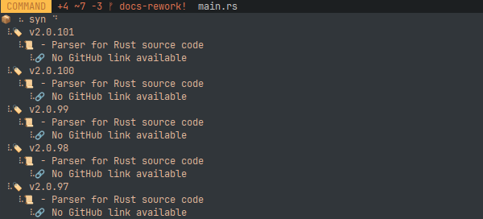 <br>

### Comparing Versions
Instantly compare bleeding-edge with latest stable. <br>
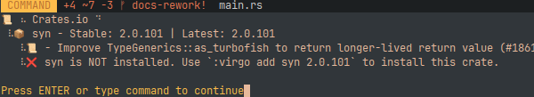 <br>

### Inspecting Dependencies
Display dependencies of a selected crate. <br>
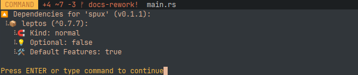 <br>

###  Viewing Documentation & Examples
Quickly fetch crate documentation and code examples. <br>
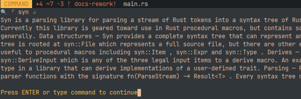 <br>

###  Viewing Examples
Displays example snippets for a selected crate. <br>
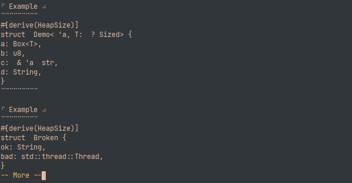 <br>

###  Opening Docs.rs
Open crate documentation directly in a browser. <br>
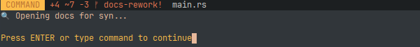 <br>

###  Editing Cargo.toml
Modify Name, Version, and Edition in Cargo.toml. <br>
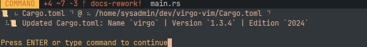 <br>

###  Checking Cargo.toml Health
Verify the integrity and structure of Cargo.toml. <br>
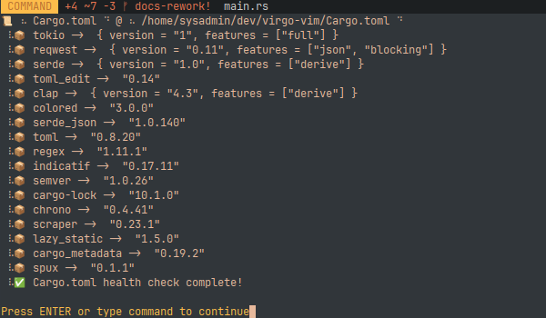 <br>

###  Viewing Crate Info
Display detailed information about a crate. <br>
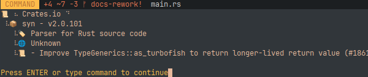 <br>

###  Inspecting Cargo.lock
Track precise crate versions in Cargo.lock. <br>
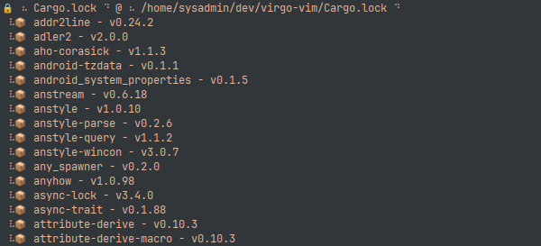 <br>

###  Checking Outdated Dependencies
Identify outdated dependencies without Cargo. <br>
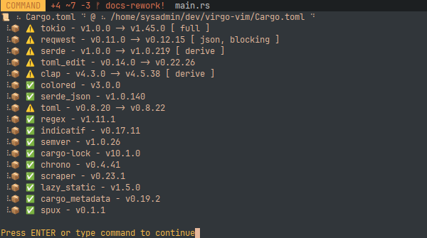 <br>

###  Removing Crates
Easily remove a selected crate. <br>
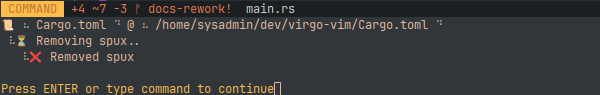 <br>

###  Restoring a Backup
Revert Cargo.toml to a previous backup. <br>
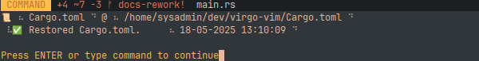 <br>

###  Rolling Back Versions
Roll back crates to a previous version. <br>
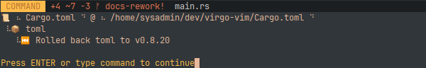 <br>

###  Searching for Crates
Find dependencies with blazing-fast lookup. <br>
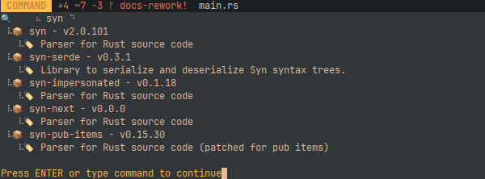 <br>

###  Viewing Crate Stats
Display download counts, ratings, and more. <br>
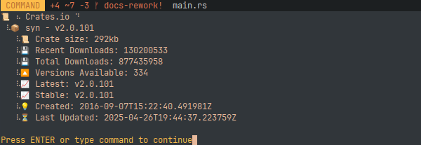 <br>

###  Viewing Dependency Tree
Display a structured dependency tree for a crate. <br>
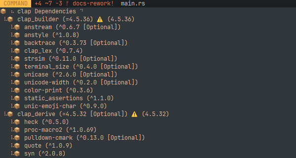 <br>

###  Discovering Trending Crates
Find trending crates on crates.io. <br>
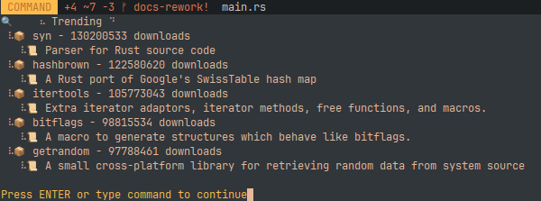 <br>

###  Updating Crates
Update a dependency to the latest stable version. <br>
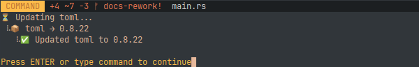 <br>

###  Viewing Available Versions
Display all available versions of a crate. <br>
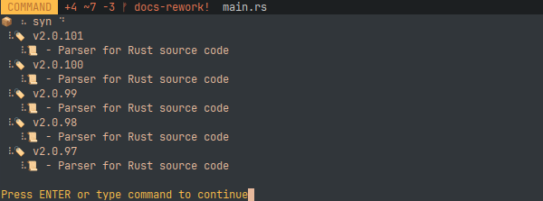 <br>


---


## <a id="troubleshooting"></a> Troubleshooting

### **Common Issues**

**Virgo won't load?**

You may have forgot to install the correct binary for your architecture.
The install script **must** be run **after** you run `:PluginInstall`
Run the install script:
```bash
~/.vim/bundle/virgo/install.sh
```

**Cargo.lock Conflicts?**

```bash
cargo generate-lockfile
```
